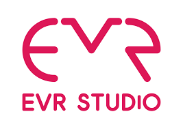
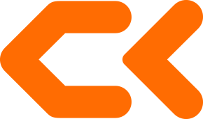
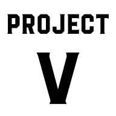
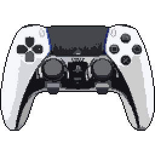
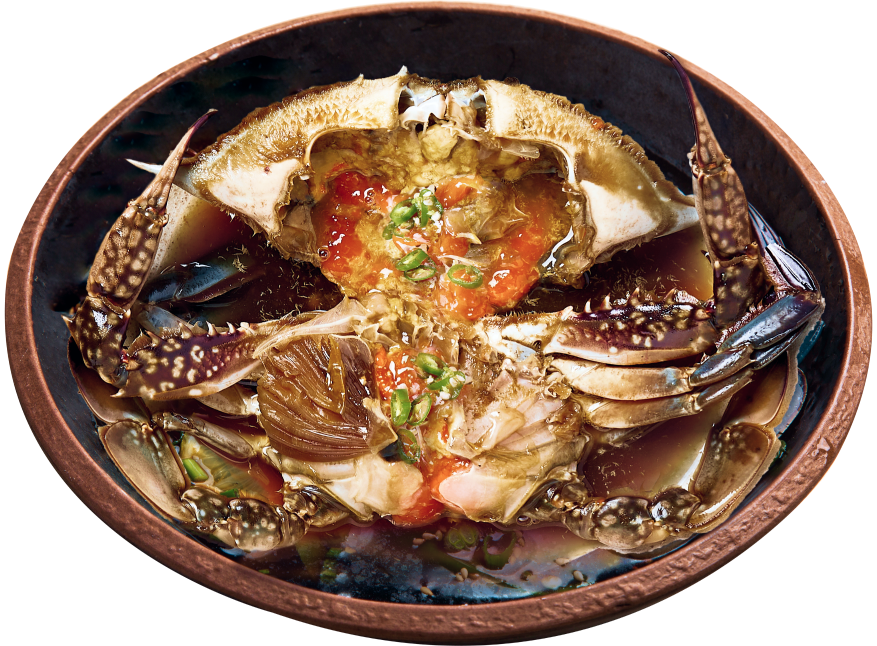
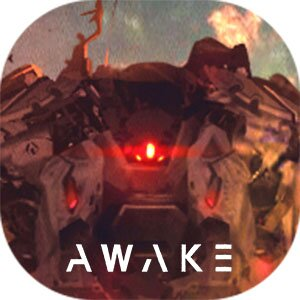

I have been working in the game industry since 2019. As a game programmer, my main goals are fast and accurate implementation of requested game content, understanding the specific needs of developers from different fields and collaborating with them to deliver great game content.

I prefer an environment where I can experience success and failure faster, learn faster, and have a greater overall impact.

I'm currently focused on improving my skills. I'm trying to write about my experiences, topics I'm currently interested in, or things I'm learning, and I'd love to get your feedback on that. I also want to help other programmers or people who want to get into game development.

Feel free to reach out.

## Experience

<table>
    <thead>
        <tr>
            <th>Company</th>
            <th>Link</th>
            <th>Role</th>
            <th>Dates</th>
            <th>Location</th>
        </tr>
    </thead>
    <tbody>
        <tr>
            <td></td>
            <td><a href="https://www.pubg.com/" target="_blank">PUBG STUDIO</a></td>
            <td>Gameplay Programmer</td>
            <td>2022.01.03 - Present</td>
            <td>Hybrid  Seoul, KR</td>
        </tr>
        <tr>
            <td></td>
            <td><a href="https://krafton.com" target="_blank">KRAFTON</a></td>
            <td>Gameplay Programmer</td>
            <td>2021 - 2022</td>
            <td>Seoul, KR</td>
        </tr>
        <tr>
            <td rowspan=3></td>
            <td rowspan=3><a href="https://evrstudio.com/" target="_blank">EVR STUDIO</a></td>
			<td>Client Programmer</td>
            <td>2019.07.29 - 2020.12.31</td>
            <td>Seoul, KR</td>
        </tr>
    </tbody>
</table>

---

## Education

<table>
    <thead>
        <tr>
            <th>School</th>
            <th>Link</th>
            <th>Degree</th>
            <th>Date</th>
        </tr>
    </thead>
    <tbody>
        <tr>
            <td rowspan=4></td>
            <td rowspan=4><a href="https://www.ck.ac.kr" target="_blank">ChungKang College of Cultural Industries</a></td>
        </tr>
        <tr>
            <td>Intensified course completion of major</td>
            <td>2020</td>
        </tr>
         <tr>
            <td>Game Contents</td>
            <td>2017-2019</td>
        </tr>
    </tbody>
</table>

## Project

<table>
    <thead>
        <tr>
            <th>Logo</th>
            <th>Title</th>
            <th>Description</th>
            <th>Link</th>
        </tr>
    </thead>
    <tbody>
         <tr>
            <td></td>
            <td>Lua Tonic</td>
            <td>Unreal Engine ❤️ Lua</td>
            <td><a href="https://github.com/bbagwang/LuaTonic" target="_blank">Github</a></td>
        </tr>
    </tbody>
	<tbody>
         <tr>
            <td></td>
            <td>Project V</td>
            <td>Korean Dark Soul</td>
            <td></td>
        </tr>
    </tbody>
	<tbody>
         <tr>
            <td></td>
            <td>UE DualSense</td>
            <td>DualSense Controller Support for  Unreal Engine</td>
            <td><a href="https://github.com/bbagwang/UE4DualSense" target="_blank">Github</a></td>
        </tr>
    </tbody>
	<tbody>
		<tr>
            <td></td>
            <td>SoyCrab Physics Engine</td>
            <td>Game Physics Engine Development</td>
            <td><a href="https://github.com/bbagwang/SoyCrabEngine" target="_blank">Github</a></td>
        </tr>
    </tbody>
	<tbody>
		<tr>
            <td></td>
            <td>AWAKE</td>
            <td>Graduational Project</td>
            <td><a href="https://youtu.be/4p4KZ2LVVeE" target="_blank">Youtube</a></td>
        </tr>
    </tbody>
</table>