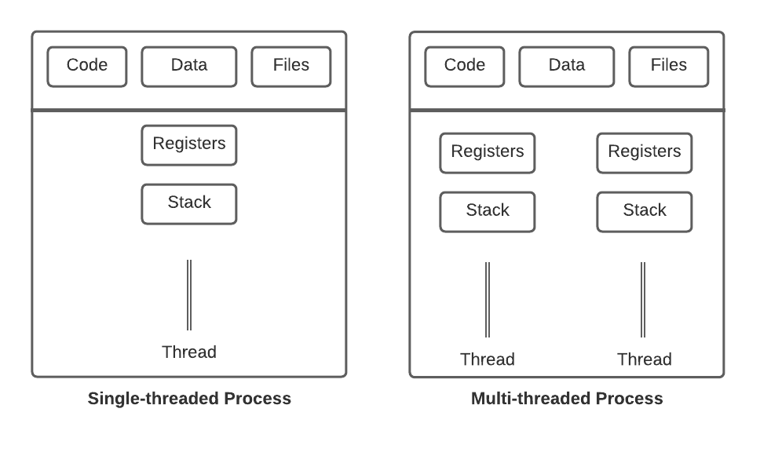

## Material
**[[C++과 언리얼로 만드는 MMORPG 게임 개발 시리즈] Part4: 게임 서버](https://inf.run/8Chk)**

## Introduction
서버 프로그래밍은 식당을 운영하는 것과 비슷하다.

식당 : 프로세스 (그림판, 메모장, 게임 서버 등등)

직원 : 스레드

영혼 : CPU 코어

식당에는 주방, 서빙, 청소 등을 담당하는 직원들이 있고, 각각의 직원들은 자신의 역할을 혼자서 또는 여럿이서 수행한다.
  
현실과는 살짝 다른 부분이 있다면, 식당 관리자(운영체제) 가 존재하고, 영혼이 직원에게 들어가 있을 때(CPU Time 을 가졌을 때) 만 일을 한다고 보면 된다.
  
어떤 식당을 운영하느냐에 따라 직원의 수가 달라지고, 직원의 역할이 달라진다.


간단한 음식을 파는 가게라면 혼자서도 운영할 수 있다.

게임 서버라면 단일 스레드로도 충분할 수 있다.


큰 식당은 혼자서 감당할 수 없다. 여러 직원들이 각자의 역할을 수행하며 식당을 운영해야 한다.

같은 맥락으로, MMO 같은 대규모 인원이 접속하여 다량의 데이터와 입력을 처리해야하는 경우, 멀티 스레드 구조를 사용하는 것이 필수적이다.


이제 스레드를 사용하여 멀티 스레드 프로그래밍에 대해 알아보자.

## Thread

스레드는 프로세스 내에서 실행되는 흐름의 단위이다.

프로세스는 최소 하나의 스레드를 가지고 있다.

스레드는 프로세스 내의 `Code`, `Data`, `Heap` 메모리를 공유한다.

`Stack` 은 각각의 스레드에 따로 존재한다.

사진으로 보면 아래와 같다.



## Basic Thread Usage

C++ 에서 스레드를 사용하는 기본적인 방법은 아래와 같다.

```cpp
#include <iostream>
#include <thread>

void HelloThread()
{
	std::cout << "Hello Thread" << std::endl;
}

int main()
{
	std::thread t(HelloThread);
	
	t.join();

	return 0;
}
```

위 코드의 결과는 다음과 같다.

```
Hello Thread
```

`thread` 헤더를 include 하고, `std::thread` 를 사용하여 스레드를 생성한다.

`std::thread` 생성자의 인자로 `함수`를 넘겨주면, 해당 함수를 새로운 스레드로 실행한다.

`join` 을 호출하여 스레드가 종료될 때까지 기다린다.

## Postpone Thread Execution

스레드를 생성하고 곧바로 사용하는 방법도 있지만, 아래와 같이 생성만 하고 나중에 사용할 수도 있다.

```cpp
#include <iostream>
#include <thread>

void HelloThread()
{
	std::cout << "Hello Thread" << std::endl;
}

int main()
{
    // thread 객체만 생성. 실행은 하지 않음.
	std::thread t;
	
    // 나중에 실행
    t = std::thread(HelloThread);

	t.join();

	return 0;
}
```

## Passing Arguments

스레드가 실행할 함수에 대한 인자를 넘겨주는 방법은 아래와 같다.

```cpp
#include <iostream>
#include <thread>

void HelloThread(int n)
{
	std::cout << "Hello Thread #" << n << std::endl;
}

int main()
{
	std::thread t(HelloThread, 1);
	
	t.join();

	return 0;
}
```

위 코드의 결과는 다음과 같다.

```
Hello Thread #1
```

## Thread ID

스레드는 각각 고유한 `ID` 를 가지고 있다.

`get_id` 함수를 사용하여 스레드의 `ID` 를 얻을 수 있다.

이 `ID` 를 사용하여 스레드를 구분할 수 있다.

발급된 `ID` 는 다른 스레드와 겹치지 않음을 보장하며, 랜덤하게 지정된다.

`ID` 는 스레드가 실행되고 있지 않은 경우 `0` 을 반환한다.

```cpp
#include <iostream>
#include <thread>

void HelloThread()
{
	std::cout << "Hello Thread" << std::endl;
}

int main()
{
	std::thread t = std::thread(HelloThread);

	std::cout << t.get_id() << std::endl;

	t.join();

	std::cout << t.get_id() << std::endl;

	return 0;
}
```

위 코드의 결과는 다음과 같다.

```
29836
Hello Thread
0
```

스레드가 종료되기 전에는 `29836` 이라는 `ID` 를 가지고 있었다.

스레드가 `join` 을 넘어 종료된 이후, 다시 `ID` 를 얻어오면 `0` 이 반환된다.

## Joinable

스레드는 현재 사용되고 있는지에 대한 체크를 위해 `joinable` 함수를 제공한다.

```cpp
#include <iostream>
#include <thread>

void HelloThread()
{
	std::cout << "Hello Thread" << std::endl;
}

int main()
{
	std::thread t = std::thread(HelloThread);

	std::cout << t.joinable() << std::endl;

	t.join();

	std::cout << t.joinable() << std::endl;

	return 0;
}
```

위 코드의 결과는 다음과 같다.
 
```
1
Hello Thread
0
```

`joinable` 함수는 구체적으로 `*this` 의 `get_id` 의 반환값이 `std::thread::id()`(기본값) 와 다른지 체크한다.

```cpp
get_id() != std::thread::id()
```

따라서 비활성 상태의 스레드는 `joinable` 하지 않다.

스레드가 실행을 완료했지만, 아직 `join` 되지 않은 스레드는 여전히 활성 상태로써 실행되고 있는 스레드로 간주되므로 `joinable` 하다.

## Hardware Concurrency

스레드를 생성할 때, `hardware_concurrency` 함수를 사용하여 현재 시스템에서 지원하는 최대 스레드 개수의 `hint` 를 얻을 수 있다.

**이 값은 `hint` 로써 제공되며, 100% 신뢰해서는 안된다.**

```cpp
#include <iostream>
#include <thread>

int main()
{
	unsigned int n = std::thread::hardware_concurrency();

	std::cout << n << std::endl;

	return 0;
}
```

현재 사용중인 Ryzen 3700X CPU 는 8 코어 16 스레드 CPU 이며, 위 코드의 결과는 다음과 같다.

```
16
```

논리 스레드의 갯수를 반환해준다고 보면 된다.
