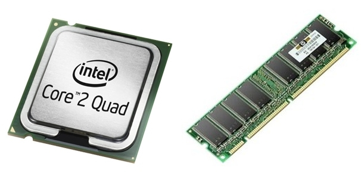
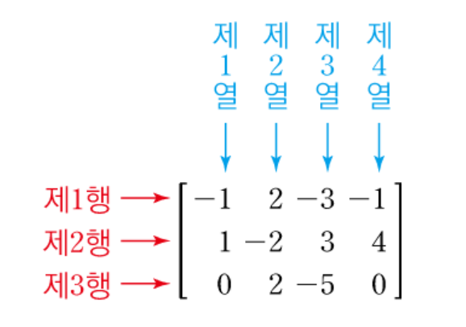
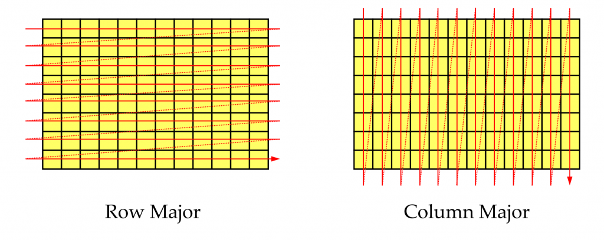

## Material
**[[C++과 언리얼로 만드는 MMORPG 게임 개발 시리즈] Part4: 게임 서버](https://inf.run/8Chk)**

## Cache



컴퓨터에는 CPU 와 메모리(RAM) 가 있다.

CPU 는 연산을 담당하고, 메모리는 데이터를 담당한다.

CPU 가 연산하며 데이터를 처리할 때, 메모리에서 데이터를 가져와서 처리한다.

하지만 이러한 과정은 꽤 시간이 많이 걸린다.

***그래서 CPU 와 메모리 사이에 `캐시(Cache)`가 존재한다.***

캐시는 CPU 에서 메모리로 데이터를 가져오는 과정을 최적화해 더 빠르게 데이터를 처리할 수 있도록 도와주기 위해 사용된다.

CPU 가 메모리에서 데이터를 가져올 때 캐시에 데이터가 존재한다면 캐시에서 데이터를 가져오게 된다.

이를 `캐시 히트(Cache Hit)` 라고 하고, 캐시에 데이터가 없어서 메모리에서 데이터를 가져오는 것을 `캐시 미스(Cache Miss)` 라고 한다.

빠른 프로그램을 위해서는 캐시 히트가 많이 일어나야 한다.

그러기 위해서 고안된 두 가지 개념을 알아야 한다.

`시간 지역성(Temporal Locality)` 와 `공간 지역성(Spatial Locality)` 이다.

### Temporal Locality

`시간 지역성`은 최근에 참조된 데이터가 가까운 미래에 다시 참조될 가능성이 높다는 것을 기반으로 한다.

방금 사용된 데이터는 곧 다시 사용될 가능성이 있다는 뜻이다.

그러므로 캐시에 데이터를 저장할 때, 방금 사용된 데이터를 저장해두면 캐시 히트가 더 많이 일어날 수 있다고 가정한다.

### Spatial Locality

공간 지역성은 한 번 참조된 데이터의 ***주변 데이터***가 곧 참조될 가능성이 높다는 것을 기반으로 한다.

데이터는 메모리 상에서 서로 가까이 위치하고 있으므로, 어떤 데이터를 참조하면 그 주변 데이터도 곧 사용될 가능성이 높다는 뜻이다.

그러므로 캐시에 데이터를 저장할 때, 함께 사용될 가능성이 높은 주변 데이터를 같이 저장해두면 캐시 히트가 더 많이 일어날 수 있다고 가정한다.

이때 `공간 지역성`을 활용하기 위해 `캐시 라인(Cache Line)` 이라는 개념이 사용된다.

### Cache Line

캐시는 데이터를 `캐시 라인(Cache Line)` 단위로 저장한다.

캐시 라인은 메모리에서 가져온 데이터를 캐시에 저장할 때, 주변에서 함께 가져오는 데이터의 크기를 의미한다.

예를 들어, 64바이트 크기의 캐시 라인을 사용한다면, 메모리에서 1바이트 데이터를 가져올 때 64바이트 데이터를 가져오게 된다.

이는 `공간 지역성`을 활용하기 위한 방법이다.

캐시 라인은 캐시의 크기와 캐시의 구조에 따라 다르게 설정할 수 있다.

## Row Major & Column Major

어떻게 해야 캐시를 효율적으로 사용할 수 있는지 예를 통해 알아보자.

프로그래밍을 배우며 한 번쯤은 for 이나 while 을 사용해 배열을 순회해본 경험이 있을 것이다.

간단하게 배열에 있는 모든 값의 합이나 소수의 개수 등을 알아보고 싶다면 결국 전체 탐색을 해야하는 상황이 온다.

2차원 배열을 탐색하는 상황을 가정하고 행을 기준으로 탐색하는 것과 열을 기준으로 탐색하는 상황을 예로 들어보겠다.

`Row Major (행 우선)` 와 `Column Major (열 우선)` 방식에 따라 어떤 차이가 존재하는 것일까?

어쨋든 동일한 메모리 공간을 순회할 것이다 무엇이 다를지 한 번 알아보자.

일반적으로 알고있는 행렬은 아래와 같이 정의된다.

행(Row) 은 가로축, 열 (Column) 은 세로축을 기준으로 아래와같이 순서를 붙여 말한다.



그럼 행 우선 방식과 열 우선 방식은 아래와 같이 순회하게 된다.



이제 이 두 방식을 코드로 구현해보자.

```cpp
#include <iostream>
#include <chrono>

int matrix[10000][10000];

int main()
{
	//1. Initialize Matrix
	for (int i = 0; i < 10000; ++i)
	{
		for (int j = 0; j < 10000; ++j)
		{
			matrix[i][j] = i + j;
		}
	}

	std::chrono::duration<double> rowMajorElapsed;
	std::chrono::duration<double> columnMajorElapsed;

	//2. Row Major Test
	{
		int sum = 0;

		auto start = std::chrono::high_resolution_clock::now();
		for (int i = 0; i < 10000; ++i)
		{
			for (int j = 0; j < 10000; ++j)
			{
				sum += matrix[i][j];
			}
		}
		auto end = std::chrono::high_resolution_clock::now();

		rowMajorElapsed = end - start;
		std::cout << "Row Major: " << rowMajorElapsed.count() << "s\n";
	}

	//3. Column Major Test
	{
		int sum = 0;

		auto start = std::chrono::high_resolution_clock::now();
		for (int i = 0; i < 10000; ++i)
		{
			for (int j = 0; j < 10000; ++j)
			{
				sum += matrix[j][i];
			}
		}
		auto end = std::chrono::high_resolution_clock::now();

		columnMajorElapsed = end - start;
		std::cout << "Column Major: " << columnMajorElapsed.count() << "s\n";
	}

	//4. Compare
	if (rowMajorElapsed < columnMajorElapsed)
	{
		std::cout << "Row Major is faster\n";
		std::cout << "Diff: " << columnMajorElapsed.count() - rowMajorElapsed.count() << "s\n";
	}
	else
	{
		std::cout << "Column Major is faster\n";
		std::cout << "Diff: " << rowMajorElapsed.count() - columnMajorElapsed.count() << "s\n";
	}
}
```

위 코드는 10000x10000 크기의 2차원 배열을 순회하는 시간을 측정하는 코드이다.

행 우선 방식과 열 우선 방식을 각각 측정하고, 어떤 방식이 더 빠른지 비교한다.

실행 결과는 아래와 같다.

```
Row Major: 0.228757s
Column Major: 0.508177s
Row Major is faster
Diff: 0.27942s
```

약 10 번 실행해본 결과 행 우선 방식이 열 우선 방식보다 약 2배 이상 빠르다는 것을 알 수 있다.

이는 `공간 지역성` 때문에 발생하는 현상이다.

행 우선 방식은 메모리 상에서 연속적인 데이터를 참조하므로 캐시 히트가 더 많이 일어나게 된다.

반면 열 우선 방식은 메모리 상에서 연속적인 데이터를 참조하지 않으므로 캐시 히트가 더 적게 일어나게 된다.

이러한 이유로 행 우선 방식이 더 빠르게 동작하는 것이다.

## Conclusion

캐시는 CPU 와 메모리 사이에서 데이터를 빠르게 처리하기 위해 사용된다.

캐시를 효율적으로 사용하기 위해서는 `시간 지역성`과 `공간 지역성`을 고려하여 프로그래밍을 해야한다.

특히 `공간 지역성`을 활용하기 위해 `캐시 라인` 이라는 개념이 도입되었는데, 이는 가져올 메모리의 주변 데이터를 같이 가져오는 것을 의미한다.

이러한 내용들을 고려하여 프로그래밍을 하면 캐시 히트가 더 많이 일어나게 되어 프로그램의 성능을 향상시킬 수 있다.
