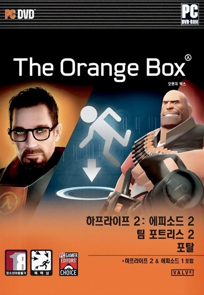

## Introduction

어린 시절, 온라인 게임만 하던 나는 이마트에서 난생 처음 `Orange Box` 라는 패키지 게임을 샀었다.

주황색 상자가 이뻐보였고, 게임이 3개나 들었다고 하니 부모님을 졸라서 샀던 기억이 난다.

다른 게임들 모두 너무 재미있었지만, 패키지에 들어있던 `Team Fortress 2` 라는 게임을 접하고, 나는 결국 꿈을 정하게 되었던 것 같다.

왜냐하면, `Team Fortress 2` 는 내가 초등학생 때 부터, 고등학교를 졸업 할 때 까지 정말 즐겁게 그리고 열정적으로 `MOD` 서버를 개발 및 운영했던 게임이기 때문이다.

서버를 운영하면서, 유저들이 내가 만든 무언가를 이용하며 재미있게 노는 것을 보는 뿌듯함은 정말 최고였다.

이런 저런 생각지 못한 부분이나 아쉬운 점에 대한 피드백을 받으며, 고쳐진 부분을 만족해 하는 모습을 보는 것 또한 즐거웠다.

점점 게임을 플레이 하는 것 보다, 게임에 무언가 만드는 것이 더 즐거워졌다.

그렇게 살다보니, 아직 너무나 많이 부족하지만, 나는 결국 게임 개발자가 되어있었다.

이처럼 원하는 대로 자유롭게 게임을 모딩 할 수 있고, 그것을 선보일 수 있는 게임의 환경은 누군가에겐 확고한 꿈을 정해줄 만큼 매력적인 기능으로 다가올 수 있다.

그래서 나도 개인 토이 프로젝트로 `Unreal Engine` 에서 사용 가능한 `Lua` 스크립팅 언어 지원 `Plugin` 을 만들어 보고자 한다.

이미 여러 구현들이 존재하고, 판매까지 되고 있지만, 나는 처음부터 직접 만들어 보는 경험과 개발 능력 향상을 위한 공부를 위해 직접 개발 해보려 한다.

이번 기회에 루아를 제대로 공부해보고, 플러그인을 만들어보며 언리얼 엔진의 일부 구조도 알아보며, 궁극적으로는 다양한 프로젝트에서 편하게 사용할 수 있는 스크립팅 기능을 만들어보는 것이 목표다.

아마 시간 날 때, 짬짬히 공부하면서 만드는 것이니, 긴 시간이 걸릴 것 같지만, 그래도 재미있을 것 같아서 시작해보려 한다.

## What is Lua?

루아는 내부적으로 `C` 언어로 작성되어 있으며, `C` 와 `C++` 언어에서 사용할 수 있다.

루아는 임베디드 가능한 스크립팅 언어 (Embeddable Scripting Language) 이다.

임베더블? 스크립팅? 헷갈리니 의미를 나눠서 알아보자.

## Embeddable Language

`Embed` 는 포함시킨다는 뜻이다.

`Embeddable` 은 `Embed` 가 `Able` 하다는 뜻이다.

그러므로 다른 프로그램 안에 포함 또는 통합될 수 있는 언어 라는 뜻이다.

이런 언어는 프로그램의 기능을 확장하거나, 사용자 정의 스크립트를 통해 프로그램의 행동을 변경할 수 있게 해준다.

간단한 예로 `Garry's Mod` 라는 게임에서 `Modding` 기능 제공을 위해 루아를 `Embed` 하여 사용하고 있다.

## Scripting Language

스크립트 언어는 프로그래밍 언어의 한 유형이다.

주로 간결하고, 사용이 쉬우며, 빠른 개발을 가능하게 하는 것이 특징이다.

스크립트 언어의 일반적인 특징을 쉽게 설명하자면 다음과 같다.

### Interpreted

스크립트 언어는 대부분 `인터프리터(Interpreter)` 를 통해 실행된다.

실행될 때마다 소스 코드가 해석되어 실행된다는 의미이다.

### Simple Syntax

스크립트 언어는 간결하고 이해하기 쉬운 문법을 가지고 있다.

그래서 개발자들은 더 빠르고 효율적으로 코드를 작성할 수 있다.

### High Level Features

많은 스크립트 언어들은 파일 처리, 네트워킹, 데이터베이스 접근과 같은 고수준의 기능을 내장하고 있다.

그래서 개발자들은 복잡한 작업을 손쉽게 처리할 수 있다.

### Dynamic Typing

스크립트 언어는 대부분 `동적 타입(Dynamic Type)` 을 사용한다.

동적 타입이란, 변수의 타입을 미리 선언하지 않고, 변수에 값을 할당할 때, 그 값의 타입에 따라 자동으로 타입이 결정되는 것을 말한다.

그러므로, 변수의 타입을 미리 선언할 필요가 없으며, 같은 변수에 다른 타입의 데이터를 할당할 수도 있다.

### Automatic Memory Management

스크립트 언어는 대부분 `가비지 컬렉션(garbage collection)` 같은 자동 메모리 관리 기능을 제공한다.

이로 인해 개발자는 메모리 할당 및 해제를 신경 쓸 필요가 없어진다.

### Platform Independent

많은 스크립트 언어들은 다양한 플랫폼에서 실행될 수 있다.

`Lua` 와 더불어, `Python` 이나 `JavaScript` 같은 언어들도 여러 운영 체제에서 동일한 방식으로 작동한다.

## Why Lua?

`Lua` 가 공식 사이트에서 사용해야 하는 이유를 다음과 같이 설명하고 있다.

### Lua is a proven, robust language

루아는 1993년 이래로 여러 버전이 실제 애플리케이션에서 사용되어 왔다.

Adobe의 Photoshop Lightroom, 디지털 TV용 Ginga 미들웨어, 게임(World of Warcraft, Angry Birds) 등 다양한 산업 분야에서 사용되고 있다.

게임 분야에서 주도적인 스크립트 언어로 자리 잡았다.

### Lua is fast

루아는 해석되는 스크립트 언어 중에서 최고의 성능을 자랑한다.

벤치마크 결과뿐만 아니라 실제 애플리케이션에서도 빠른 속도를 보인다.

더 빠른 속도가 필요하다면, JIT 컴파일러를 사용하는 `LuaJIT` 을 사용할 수 있다.

### Lua is portable

루아는 작은 패키지로 제공되며 표준 C 컴파일러가 있는 모든 플랫폼에서 쉽게 빌드된다.

Unix 및 Windows의 모든 버전, 다양한 모바일 기기, 임베디드 마이크로프로세서, IBM 메인프레임 등에서 작동한다.

### Lua is embeddable

루아는 작은 메모리를 사용한다.

다른 언어로 작성된 코드와 강력한 통합을 가능하게 하는 간단하고 잘 문서화된 API를 가지고 있어, 어플리케이션에 쉽게 내장할 수 있다.

### Lua is powerful (but simple)

루아는 언어 자체에 많은 기능을 직접 제공하기보다는 기능을 구현하기 위한 메타-메커니즘을 제공한다.

이는 언어를 작게 유지하면서도 비전통적인 방식으로 의미론을 확장할 수 있게 한다.

### Lua is small

루아를 애플리케이션에 추가해도 프로그램이 커지지 않는다.

소스 코드와 문서가 포함된 Lua 5.4.6의 tarball은 압축 상태에서 355K, 압축 해제 상태에서 1.4M 다.

### Lua is free

루아는 MIT 라이센스 하에 배포되는 무료 오픈소스 소프트웨어다.

상업적 목적을 포함한 모든 목적으로 무료로 사용할 수 있다.

## My Thoughts on Why Using Lua

당연히 공식 사이트에는 장점만 언급해두었겠지만, 우린 단점도 확인해봐야한다. 그리고 루아에도 단점이 있다.

일단 근본적으로 인터프리터를 한 번 통해서 실행되기 때문에, 컴파일 언어에 비해 느리다.

루아는 생각보다 많은 기능을 제공하지 않는다. 그래서 루아 그 자체로는 많은 것을 할 수 없다.

파이썬을 생각해보면 라이브러리 천국이다, 하지만 루아는 모듈이나 라이브러리를 찾아다녀야 하고, 신뢰성이 부족한 라이브러리가 많다.

그래서 루아를 제대로 사용하려면, 루아를 사용하는 어플리케이션에 맞는 모듈이나 라이브러리를 직접 만들어야 할 때가 많다고 한다.

이러한 단점은 사실 지금 내가 하려는 것에 큰 문제는 아니다.

루아 스크립트를 이용한 모딩 기능을 제공하는 것이 목표이기 때문이다.

모딩 기능은 이미 만들어진 게임의 뼈대 위에 덮어지는 것이다.

결국 이미 존재하는 인게임에 사용되는 함수나 이벤트에 바인딩 되어 사용될 것이다.

루아를 사용해 처음부터 끝까지 게임을 만들 것은 아니기 때문에, 루아가 제공하는 기능이 부족하다고 해도 큰 문제가 되지 않는다.

만약 부족하다 해도, 언리얼 엔진에서 제공하는 거의 대부분의 기능을 바인딩해서 사용할 수 있을 것이기 때문에, 큰 문제가 되지 않을 것이다.

루아를 이용해 모든 로직을 작성하는 것은 아니기 때문에, 성능에 큰 영향을 미치지 않을 것이다. (아마도)

## Conclusion

꽤나 주저리주저리 길게 적었은 것 같지만, 일단 내가 생각하는 Introduction 은 여기까지다.

시작하는 이유와 그에대한 내 생각과 감상을 적어보았다.

그리고 루아에 대한 내용을 함께 적었다. 아직 루아를 잘 모르면서도 말이다.

그래도 루아가 뭔지는 알고 시작해야 하기 때문에 약간의 루아와 관련 설명을 조사해서 적었다.

나중에 공부하다 틀린 내용이 나오더라도, 내용을 추가하는 것이 아니라면 최대한 수정하지 않으려고 한다.

그리고 만약 플러그인을 완성하게 된다면, 그 때 다시 돌아와 여기에 썼던 내용을 보고 내 생각을 다시 적어보겠다.

## Reference

- [Lua.org](https://www.lua.org/)
- [Lua 5.4 Reference Manual](https://www.lua.org/manual/5.4/)
- [Lua 5.4 Reference Manual (한국어)](https://wariua.github.io/lua-manual/5.4/)
