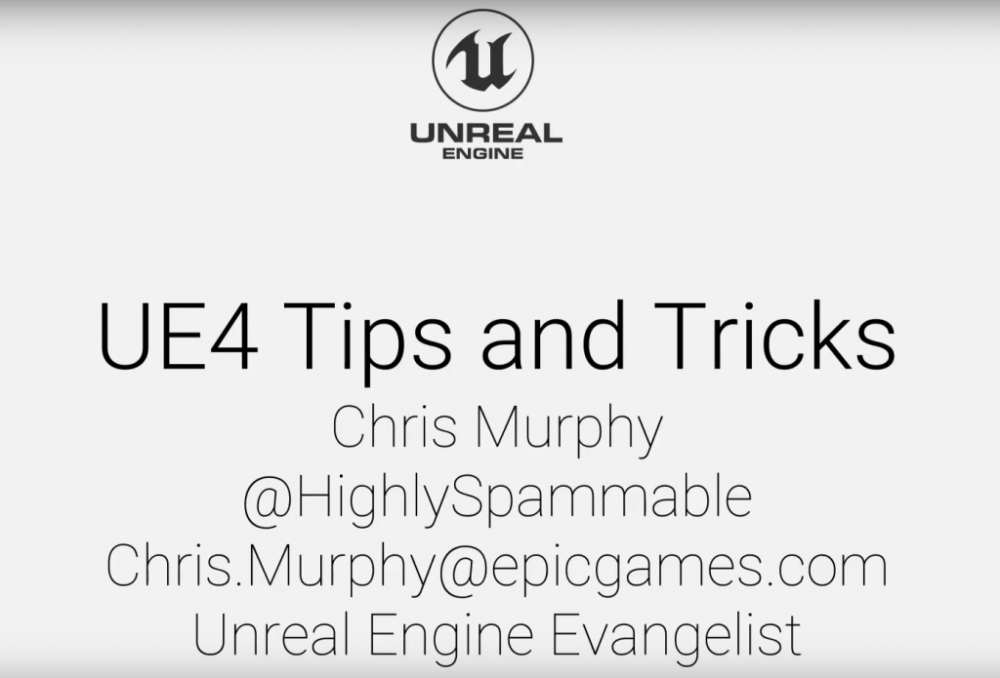
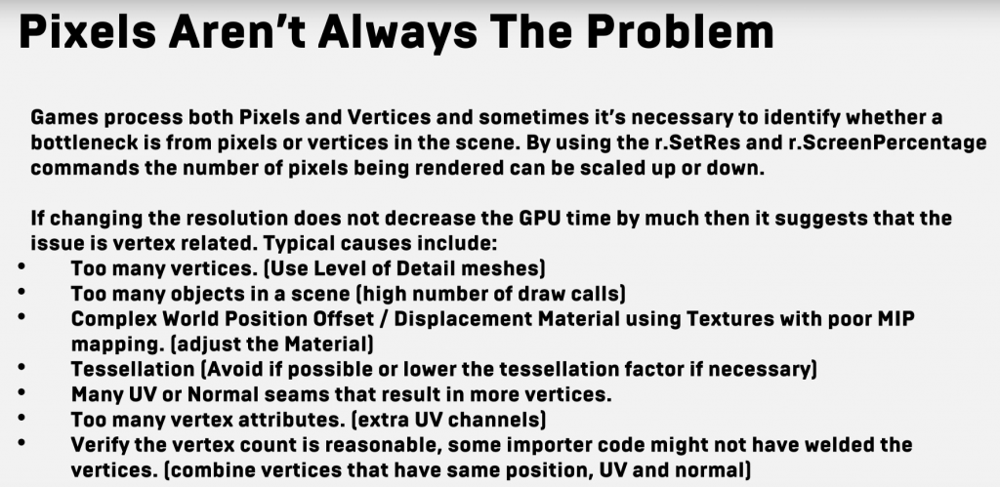
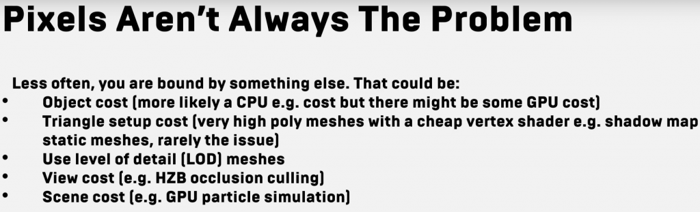
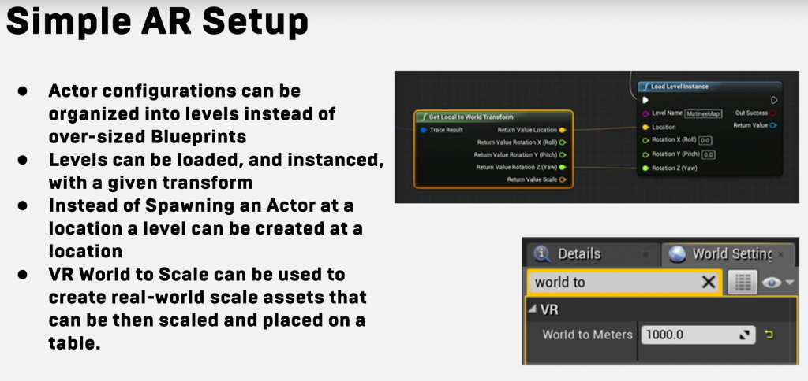
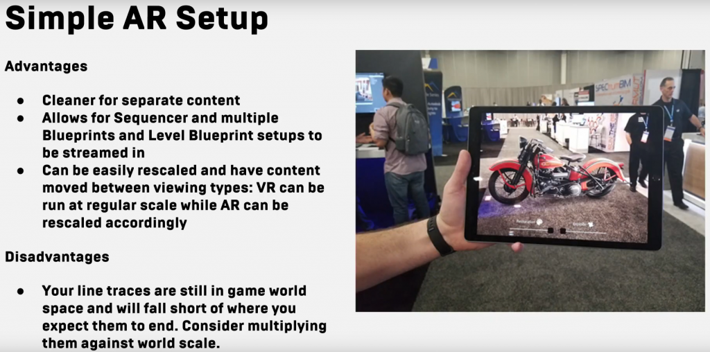



## DISCLAIMER

현 자료는 Epic Games의 Unreal Engine EVnagelist인 Chris Murphy님의 언리얼 서밋 2019 발표 자료 내용입니다. 모든 내용은 영상을 보며, 작성하였으며, 본인 개인의 공부 목적으로 간단하고 짧게 정리한 내용이라, 부정확한 정보가 존재하니 이점 유념하여 봐주시길 바랍니다.

1. 상단의 Help->Console Variables에 들어가보면 에디터에서 사용할 수 있는 Console Command들을 HTML 페이지를 통해 검색해서 볼 수 있다.  
    
2. 수학을 잘 모르는 개발자나 아트 직군을 위해서 Math Hall 이라는 수학 수식 안내용 맵이 존재한다.  
    
3. 아트나 기획직군에게 엔지니어 멘토를 붙여주면 블루프린트를 이용한 워크플로에 많은 도움이 된다.  
    
4. 오소그래픽 뷰포트에서 마우스 휠을 누르고 마우스를 움직이면 거리를 잴 수 있다.  markup
    
5. Alt+마우스 휠을 누르면 임시 Pivot을 설정해 물체의 Transform을 변경하기 아주 쉬워진다.  
    
6. Ctrl\_마우스 휠을 누르면서 드레그를 하면 뷰모드를 바꿀 수 있다. 방향마다 가는 뷰모드가 달라진다.  
    
7. Shift+마우스 드레그를 하면 물체를 바라보고있던 카메라와 함께 움직인다.  
    
8. Ctrl+마우스 버튼(왼쪽,오른쪽,둘다)을 누르면 물체의 위젯을 직접 잡지 않아도 움직일 수 있다.  
    
9. Ctrl+'(Tilt)를 누면 로컬 좌표계와 월드 좌표계로 전환할 수 있다.  
    
10. 오른쪽 클릭을 누르고 마우스휠을 올리거나 내리면 움직이는 속도를 바꿀 수 있다.  
    
11. 떠있는 물체에다 End 키를 누르면 바닥에 붙는다.  
    
12. 뷰포트 옵션 메뉴의 Layouts 탭에서 뷰포트를 나눌 수 있는 옵션이 있다.  
    
13. Landscape Grass Node 에서 지형의 식생 분포나 배치를 도와주는 노드가 있다.  
    
14. 에디터 값 입력창에서 수식을 통해 값을 계산해 적용할 수있다. ex(1.0/2)를 Location 변수 지정에 사용가능.  
    
15. Call in Editor 이벤트 노드를 붙이면 동적으로 에디터 디테일 창에서 버튼을 통해 함수나 로직을 작동시킬 수 있다.  
    
16. 머티리얼을 통해 Landscape를 만들 수 있다. Draw Material to Render Target 노드를 설정 후, Landscape Inport Heightmap form Render Target 노드를 사용하면 된다.  
    
17. 물체를 흩어놔야하는 경우 Simulate Physics가 켜져있는 상태로 에디터를 플레이 해서 어지럽힌 후 K키를 누르면 그 위치에 고정되며, 에디터 플레이가 종료되어도 그 자리로 위치가 고정된다.  
    
18. 콘텐츠 브라우저에서 검색 구문을 통해 더 세세하게 검색할 수 있다.  
    
19. Alt+Shift+O 키를 이용해 에셋 검색창을 바로 열 수 있다.  
    
20. Blutilities 라는 스크립팅 유틸리티가 있다. (플러그인 기본 비활성화)  
    에디터 유틸리티 위젯이 있으며, Editor Widget을 만들어 게임 테스트 등을 위한 툴을 만들 수 있다.  
    
21. Tick을 유의해 사용하자. 상황에 따라 타임라인, 타이머 등을 가급적 사용하고, 틱이 필요한 상황에서만 틱을 껏다 켜서 사용할 수 있도록 하며, Event Driven System을 만들자. Tick이 필요없는 엑터는 Actor Tick에서 Tick을 끄자, Blueprints 탭에서도 Can Blueprint Tick by Default를 끄도록 하자.  
    
22. 게임이 잠깐씩 멈추는 것을 로그로 뽑아 볼 수 있다.  
    t.HitchFrameTimeThreshold를 설정하면 볼 수 있다.  
    
23. 콘텐츠 브라우저에서 폴더에 오른쪽 클릭을해서 Set Color를 하면 폴더의 색을 바꿀 수 있다.  
    
24. 컬러 픽커를 통해 색을 고를 수 있다.  
    
25. 버츄얼 카메라를 통해 핸드폰의 회전이나 위치를 동기화해서 게임속화면을 볼 수 있다.  
    
26. 블루프린트 연결 노드를 Ctrl키를 누른뒤 잡으면 지우지 않고도 움직일 수 있다.  
    
27. 이미 있는 지역변수를 오른쪽 클릭해서 Promote to Variable로 하면 변수로 설정할 수 있다.  
    
28. 건틀렛(Gauntlet)프레임워크를 사용하면 멀티 플렛폼을 위한 빌드, 테스트 등등을 진행할 수있다.  
    
29. Procedural Foliage Tool을 사용해서 폴리지를 더 현실감있게 배치할 수 있다.  
    
30. Visualisation Modes를 통해 Deferred Render 버퍼의 모든 것을 볼 수 있다.  
    
31. 맵 속 오브젝트를 누르고 복사해 메모장 같은 편집기에 불여넣으면 디테일 설정들이 복사되어 나타난다.  
    
32. 마켓 플레이스에 Free Automotive Materials가 있다. (PBR 머티리얼들)  
    
33. 마켓 플레이스에 Paragon 에셋들 전부 풀었다.  
    
34. 오브젝트를 옮길 때, V키를 누르면 버텍스 스냅이 가능하다.  
    
35. Pivot Painter 2를 쓸 수 있다. (Extra에서 설치해야함)  
    
36. 모바일용 플러그인들이 존재한다. (사운드 볼륨, 배터리 잔량, 온도, GPS, 등등)  
    
37. 로보리콜 모드킷 있으니까 함 써봐라 VR게임 만들면서 여러 샘플이나 참고자료를 만들어 두었다.  
    
38. 로보리콜용 Behavior Tree 보면 공부 많이 될꺼다.  
    
39. Environmental Query System(EQS)로 맵상의 AI에게 지형에서도 정보를 얻을 수 있게 해준다.  
    
40. 화면 분할 플레이모드가 있다.  
    
41. Animation Fast Path라는 기능을 사용하면 변수 접근이 최적화되어, 퍼포먼스가 올라간다.  
    (프로젝트 세팅에서 Optimize Anim Blueprint Member Variable Access)  
    
42. Asset sManagement Framework를 사용하면 에디터나 런타임에서 에셋을 로드하거나 찾을 수 있다. hard reference를 그만 사용할 수 있도록 해줌.  
    
43. VR에서는 포워드 렌더러 사용을 고려해봐라. VR은 포워드 렌더러에 최적화 해놨다. 그리고 그냥 게임들도 라이트 많이 없으면 포워드 렌더러 사용해봐라.  
    
44. Lightweight Rigid Body Simulation이 있다. 캐릭터들의 시뮬레이션이 한 번에 많이 일어날 때 사용해라.  
    
45. 대규모 월드를 만들 경우 월드 컴포지션 툴을 사용해라.(레벨 스트리밍에서 사용 불가)  
    
46. 이펙트의 Overdraw를 조심해라. 파티클의 경우 Cutout 모드를 사용하는게 좋다.  
    
47. 머티리얼 Draw Cost를 조사하라.  
    r.rhicmdbpass 1  
    r.rhithread.enable 0  
    r.showmaterialdrawevents -1  
    Profilegpu  
    (항상 믿을만 한 것은 아님)  
    
48. 머티리얼 함수를 레이어로 쓸 수 있다. (RGB에 따라 재질 머티리얼 설정 등등)  
    
49. 스텐실 버퍼를 사용하면 에셋이 다른 버퍼에서 렌더링 될 수있도록 해준다. (VFX에 유용)  
    
50. Pixel Depth Offset을 쓰면 오클루전 테스트를 렌더러 안에서 조정할 수 있다.(추가적인 약간의 오버헤드 발생)  
    
51. World Aligned Material을 만들어 쓰면 base UV를 무시하고 맵상에서 균일한 패턴을 얻을 수 있다. (자세한 건 모름)  
    
52. Pre-Skinned Local Position/Normal. T-Pose의 위치를 캐시해 매시에 데칼이나 위장 머티리얼을 래핑할 필요없이 사용할 수 있다. (잘 모름)  
    
53. Sun Position Calculator Plugin 이 있다. 블루프린트 엑터이고, 태양의 위치를 조정할 때 아주 좋다.  
    
54. Mesh Decal은 간과할 거이 아니다. Masked된 메쉬와 거의 차이가 없다.  
    
55. 자동 LOD 생성이 가능하다. 필요한 곳에 그룹으로 묶어 사용할 수도 있다.  
    
56. Skeletal Mesh도 LOD 생성이 가능하다.  
    
57. Low Latency Frame Syncing Mode를 사용하면 인풋 레이턴시를 줄일 수 있다.(잘 모름)  
    r.OneFrameThreadLag는 항상 켜져있는 상태이고,  
    r.GTSyncType 을 0,1,2 값으로 수정하며 사용한다.  
    
58. 고해상도 스크린샷 촬영을 에디터 옵션탭에서 사용할 수 있다.  
    
59. 쉐이더 컴파일이 오래 걸린다면 프로젝트 세팅에서 Shader Permutation을 비활성화 하도록 해보자.  
    
60. 픽셀은 항상 문제가 되는 것이 아니다. (사진 첨부)  
    
61. 블루프린트가 Hard Reference 되는 것을 피하라. 블루프린트가 다른 블루프린트를 레퍼런싱 한다면 그 블루프린트들은 모두 메모리에 로드될 것이다. 쌓이다 보면 겉잡을 수 없으니 미리 주의하라. 특히 게임이 느려지지는 않겠으나, 메모리나 로드타임이 오래걸리니 주의하라.  
    
62. PlotFunctionOnGraph 노드를 사용하면 현재 구성된 로직이 어떻게 변화하는지 그래프로 확인할 수 있다.  
    
63. 프로젝트 세팅에서 Small Tool Bar Icons 를 사용하면, 툴바 아이콘들이 작아져 화면을 더 볼 수 있다. (프로같아보임)  
    
64. 나이아가라 이펙트를 만들 때, 파티클은 Interpolated Spawning을 가능한 비활성화 하라. 오버헤드가 발생하며, 비활성화 하면 더 많은 파티클을 훨씬 적은 오버헤드로 생성 가능하다.  
    
65. VR Editor로 레벨 콘텐츠를 배치하거나 수정하거나 할 수 있다.  
    
66. AR 셋업용 팁. (사진 첨부)

## 60. 자료

## 66. 자료

아죠시... 100개가 아닌데요...?
